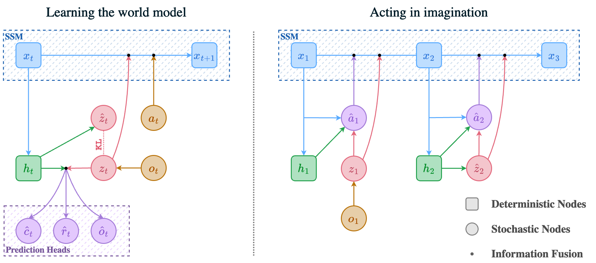
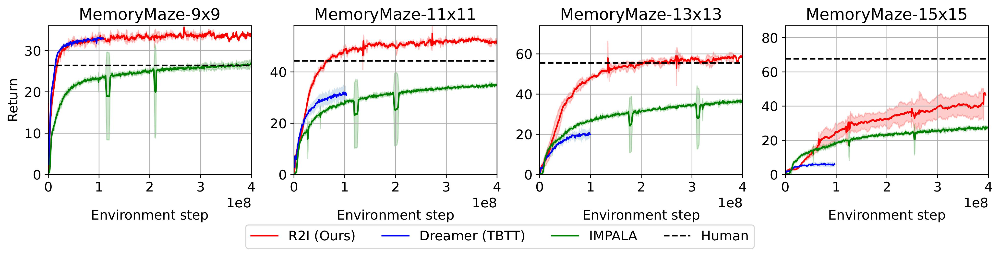

# Mastering Memory Tasks with World Models

---

>  M. R. Samsami\*, A. Zholus\*, J. Rajendran, S. Chandar. Mastering Memory Tasks with World Models. ICLR 2024, top‑1.2% (oral) <br /> 
>  __[[Project Website]](https://recall2imagine.github.io)__  &nbsp; &nbsp; &nbsp;  __[[Paper]](https://arxiv.org/abs/2403.04253)__  &nbsp; &nbsp; &nbsp;  __[[Openreview]](https://openreview.net/forum?id=1vDArHJ68h)__  &nbsp; &nbsp; &nbsp;  __[[X Thread]](https://x.com/apsarathchandar/status/1772345328617824502)__

---

This repo contains the official implementation of the Recall to Imagine (R2I) algorithm, introduced in the paper
**Mastering Memory Tasks with World Models**. R2I is a generalist, computationally efficient, model-based agent focusing on memory-intensive reinforcement learnin (RL) tasks. It stands out by demonstrating superhuman performance in complex memory domain, Memory Maze. The codebase, powered by JAX, offers an efficient framework for RL development, incorporating state space models.


<p float="center">

</p>

## Table of Contents
- [Prerequisites](#prerequisites)
- [Installation](#installation)
  - [Conda](#conda)
  - [Docker & Singularity](#docker--singularity)
- [Running Experiments with Containers](#running-experiments-with-containers)
- [Reproducing Results from the Paper](#reproducing-results-from-the-paper)
  - [Memory Maze](#memory-maze)
  - [POPGym](#popgym)
  - [BSuite](#bsuite)
- [BibTeX](#bibtex)
- [Acknowledgements](#acknowledgements)

## Prerequisites

Before diving into the installation and running experiments, ensure you meet the following prerequisites:

| Requirement        | Specification                                                  |
|--------------------|----------------------------------------------------------------|
| **Hardware**       | GPU with CUDA support                                          |
| **Software**       | Docker or Singularity for containerized environments, conda    |
| **Python Version** | 3.8                                                            |
| **Storage**        | At least 130GB for the Memory Maze experiment's replay buffer  |


## Installation

### Conda

We provide a self-contained conda environment for running experiments. To setup the env do

```sh
conda create -n recall2imagine python=3.8
conda activate recall2imagine
cd env && conda env update -f conda_env.yaml
pip install \
    "jax[cuda11_local]" -f https://storage.googleapis.com/jax-releases/jax_cuda_releases.html \
    dm-haiku \
    flax \
    optax==0.1.5
```

Though conda environment should work, the recommended way of setting up the environment is through 
docker or singularity containers. See below for details.

### Docker & Singularity

The most reliable way to reproduce the results from the paper is through containers.
To build a docker image do

```sh
cd env && docker build -t r2i .
```

This steps takes several mins to complete. Alternatively, you can just pull our pre-built image:

```sh
docker pull artemzholus/r2i && docker tag artemzholus/r2i r2i
```

If you are going to run the code inside of a singularity container, convert the docker image to singularity.
Note that the code below creates a lot of temporary files in the home directory  to avoid that, do 

```sh
export SINGULARITY_CACHEDIR=<STORAGE_FOLDER>
```

If you're not sure whether you need this, just skip this step.

To convert the image, do

```sh
singularity pull docker://artemzholus/r2i
```

## Running experiments with containers 

To run experiments docker, launch an interactive docker container: 

```sh
docker run --rm -it --network host -v $(pwd):/code -w /code r2i bash
```

This will lead to the interactive shell within a container. Run any python training script
within that shell.

For singularity:

```sh
singularity shell --nv <IMAGE_PATH.sif>
```

where image path it the file name that was downloaded when doing `singularity pull`


## Reproducing results from the paper

The code was designed with reproducibility in mind. 

### Memory Maze

**TL;DR:** use the following command:

```sh
python recall2imagine/train.py \
    --configs mmaze --task gym_memory_maze:MemoryMaze-9x9-v0 \
    --wdb_name memory_maze_9x9 \
    --logdir ./logs_memory_maze_9x9
```

By default, the script uses 1 GPU. 
To ensure that you match the training speed reported in our paper, consider using two GPUs
(this does not affect the sample efficiency):

```sh
python recall2imagine/train.py \
    --configs mmaze --task gym_memory_maze:MemoryMaze-9x9-v0 \
    --wdb_name memory_maze_9x9 \
    --jax.train_devices 0 1 \
    --jax.policy_devices 0 \
    --logdir ./logs_memory_maze_9x9
```

**NOTE**: By default the training script uses disk-based replay buffer. In memory maze our 
default replay buffer size is 10M image RL steps which takes about 130GB of space.
Therefore, be sure to have enough space before running, since the scipt will allocate 
the whole file in the beginning of the training.



Since this experiment may take a long time, if you are a large compute cluster user, 
you may have a limited maximal duration of experiments. Exactly for that scenario, we designed a new 
replay buffer for efficient restarting of very long RL experiments. The idea is to keep two 
versions of the replay buffer - one in the fast, but temporary storage, the other in the slower but 
lifelong storage. Use the following pattern to continue your experiment after interruption:

```sh
python recall2imagine/train.py \
    --configs mmaze --task gym_memory_maze:MemoryMaze-9x9-v0 \
    --wdb_name memory_maze_9x9 \
    --jax.train_devices 0 1 \
    --jax.policy_devices 0 \
    --use_lfs True --lfs_dir <LONGTERM_STORAGE> \
    --logdir <TMP_STORAGE>
```

Use this command for both first run and each next one. It knows how to deal with the state.
This buffer is very reliable, it has a good fault tolerance and it is the way how we conducted 
our original experiments in the paper.


### POPGym

Use the following command:

```sh
python recall2imagine/train.py \
    --configs popgym --task gym_popgym:popgym-RepeatPreviousEasy-v0 \
    --wdb_name  popgym_repeat_previous_easy \
    --logdir ./logs_popgym_repeat_previous_easy
```

### BSuite 

(Coming soon!)

## BibTeX

If you find our work useful, please cite our paper:

```
@inproceedings{
    samsami2024mastering,
    title={Mastering Memory Tasks with World Models},
    author={Mohammad Reza Samsami and Artem Zholus and Janarthanan Rajendran and Sarath Chandar},
    booktitle={The Twelfth International Conference on Learning Representations},
    year={2024},
    url={https://openreview.net/forum?id=1vDArHJ68h}
}
```

## Acknowledgements

We thank Danijar Hafner for providing the DreamerV3 implementation, which this repo is based upon. 

[arxiv]: https://github.com/chandar-lab/recall2imagine
[website]: https://recall2imagine.github.io/
[twitter]: https://github.com/chandar-lab/recall2imagine
